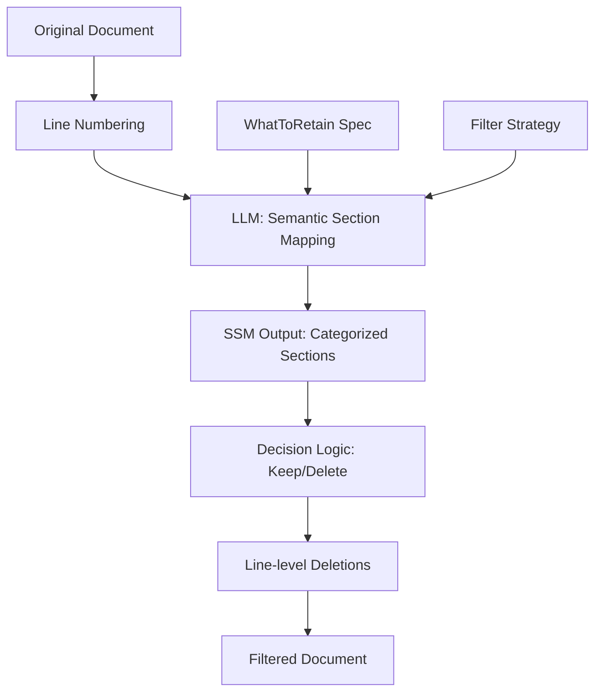

# How Subtractive Filtering Works

## The Problem: LLM Input/Output Asymmetry

Large Language Models have a fundamental limitation:
- **Input capacity**: Can process 50,000+ tokens
- **Output capacity**: Limited to ~8,000 tokens
- **Result**: Cannot extract all relevant content from large documents

Traditional extractive filtering hits this wall - the LLM cannot output all the content you want to keep.

## The Solution: Subtractive Filtering

Instead of asking the LLM "what to keep", we ask "what to delete". This ingenious approach:
- Outputs deletion instructions (small)
- Preserves original content exactly (no reformatting)
- Reduces costs by 81-98%

## Architecture: Semantic Section Mapping (SSM)

Subtractive filtering uses a sophisticated approach called **Semantic Section Mapping** to understand document structure before filtering.

### Phase 1: Document Preprocessing

```python
# Original document
document = """
# API Documentation
Welcome to our API docs...
## Authentication
Use OAuth2 for auth...
## Endpoints
GET /api/users
POST /api/users
[Footer links here]
"""

# Convert to numbered lines
numbered_document = """
[1] # API Documentation
[2] Welcome to our API docs...
[3] ## Authentication
[4] Use OAuth2 for auth...
[5] ## Endpoints
[6] GET /api/users
[7] POST /api/users
[8] [Footer links here]
"""
```

### Phase 2: Semantic Section Mapping (SSM)

The LLM analyzes the numbered document and creates a **Table of Contents** with semantic understanding:

```json
{
  "sections": [
    {
      "name": "API Documentation Header",
      "category": "header",
      "start_line": 1,
      "end_line": 2,
      "is_content": true,
      "is_navigation": false
    },
    {
      "name": "Authentication Section",
      "category": "content",
      "start_line": 3,
      "end_line": 4,
      "is_content": true,
      "is_navigation": false
    },
    {
      "name": "API Endpoints",
      "category": "code",
      "start_line": 5,
      "end_line": 7,
      "is_content": true,
      "is_navigation": false
    },
    {
      "name": "Footer Links",
      "category": "footer",
      "start_line": 8,
      "end_line": 8,
      "is_content": false,
      "is_navigation": true
    }
  ]
}
```

#### SSM Categories

The system recognizes these semantic categories:
- **`content`** - Main document content
- **`code`** - Code examples, API definitions
- **`header`** - Document headers and titles
- **`navigation`** - Navigation menus and links
- **`footer`** - Footer information
- **`metadata`** - Document metadata

Each section is evaluated against the extraction specification to determine:
- **`is_content`**: Does this match what we want to retain?
- **`is_navigation`**: Is this primarily navigation?

### Phase 3: Intelligent Deletion Decision

The `_should_keep_section()` method applies sophisticated logic:

```python
def _should_keep_section(section):
    # Always keep if marked as content
    if section.is_content:
        return True
    
    # Always keep code and content categories
    # (protects against LLM mistakes)
    if section.category in ["code", "content"]:
        return True
    
    # Delete navigation/footer/header ONLY if explicitly non-content
    if section.category in ["navigation", "footer", "header"]:
        if section.is_content is False:
            return False
        return True
    
    # Default: keep unless explicitly marked as non-content
    return section.is_content if section.is_content is not None else True
```

This ensures:
- Important content is never accidentally deleted
- Navigation/footers are removed only when clearly identified
- Code blocks are protected even if mislabeled

### Phase 4: Line Deletion Execution

Based on SSM analysis, the system:

1. **Identifies lines to keep**:
   ```python
   lines_to_keep = {1, 2, 3, 4, 5, 6, 7}  # Everything except line 8
   ```

2. **Creates deletion records**:
   ```json
   {
     "deletions_applied": [
       {
         "start_line": 8,
         "end_line": 8,
         "name": "Footer Links",
         "category": "footer",
         "is_content": false,
         "is_navigation": true
       }
     ]
   }
   ```

3. **Applies deletions** to create filtered output

## Complete Processing Flow



## Example: Real Document Processing

### Input Specification
```python
WhatToRetain(
    name="technical API content",
    desc="API endpoints, authentication, code examples",
    text_rules=[
        "Keep all code examples",
        "Keep authentication details",
        "Remove navigation and marketing"
    ]
)
```

### SSM Analysis Result
```
Document: 980 lines
Sections identified: 47
- Content sections: 12 (kept)
- Code sections: 8 (kept)
- Navigation sections: 15 (deleted)
- Footer sections: 5 (deleted)
- Header sections: 7 (kept if marked as content)

Lines kept: 823 (84%)
Lines deleted: 157 (16%)
```

### Cost Comparison

| Mode | Input Tokens | Output Tokens | Total Cost | Time |
|------|--------------|---------------|------------|------|
| Extractive | 5,000 | 2,500 | $0.0382 | 65s |
| Subtractive | 5,000 | 150 | $0.0071 | 36s |
| **Savings** | - | **94% less** | **81% less** | **45% faster** |

## Key Advantages of SSM-based Subtractive Filtering

1. **Semantic Understanding**: Categorizes content by meaning, not just patterns
2. **Preservation of Format**: Original formatting retained exactly
3. **Transparent Decisions**: Every deletion is explained with section name and category
4. **Safety Mechanisms**: Multiple checks prevent accidental content loss
5. **Massive Cost Savings**: 81-98% reduction in API costs
6. **Faster Processing**: 40-65% reduction in processing time

## Implementation Details

### Core Components

1. **FilterHero** (`filterhero.py`): Orchestrates the filtering process
2. **FilterEngine** (`filter_engine.py`): Manages LLM interactions
3. **MyLLMService** (`myllmservice.py`): Handles SSM generation via structured outputs
4. **TocOutput Schema**: Pydantic model ensuring valid SSM structure

### Prompt Engineering

The SSM prompt instructs the LLM to:
- Analyze from line 1 to the last line
- Categorize every section semantically
- Ensure complete coverage (no gaps)
- Mark sections as content/non-content based on extraction spec
- Output valid JSON with structured sections

### Error Prevention

Multiple safeguards ensure quality:
- Structured output validation via Pydantic
- Line range validation
- Gap detection between sections
- Category-based safety rules
- Fallback to keep content when uncertain

## When to Use Subtractive Filtering

**Ideal for:**
- Large documents (>100 lines)
- Preserving exact formatting
- Cost-sensitive applications
- Consistent, predictable filtering
- Understanding what was removed

**Not ideal for:**
- Very small documents (<50 lines)
- Need for content transformation
- Summarization tasks
- When output format differs from input

## Conclusion

Subtractive filtering with SSM represents a paradigm shift in document processing:
- **From "what to keep" to "what to delete"**
- **From reformatting to preservation**
- **From expensive to economical**
- **From opaque to transparent**

The combination of semantic understanding (SSM) and intelligent deletion logic makes subtractive filtering both powerful and safe, achieving superior results at a fraction of the cost.